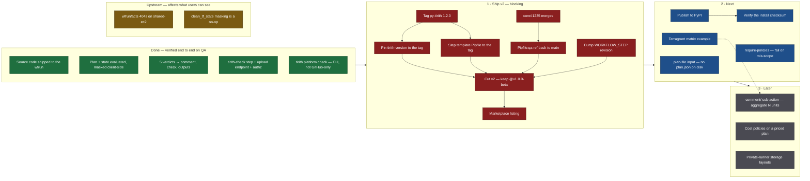

# Tirith Policy Check — roadmap

Scope is the GitHub Action (`StackGuardian/sg-cli-gh-action`). Items that depend on another
repository say so. Edges are real blockers, not sequencing preferences.

## Already implemented

✅ verified on QA · ⚪ built but not exercised · ⚠️ works, with a caveat worth knowing

### What reaches the workflow run

| | |
|---|---|
| ✅ **The terraform source itself** | Packed into a `tar.gz`, uploaded via `configuration_upload_url`, and passed as `RuntimeParameters.terraformProjectZip`. The run controller unpacks it **in place of a VCS checkout**, so it becomes `LOCAL_IAC_SOURCE_CODE_DIR`. No VCS integration and no git credentials are involved. |
| ⚪ **…but nothing evaluates the HCL yet** | tirith has no HCL provider, so the source currently only serves as the working directory. It is shipped so that HCL policies, autofix and run reproduction have something to work from later. This is the one place "implemented" and "useful" differ. |
| ✅ **`plan.json`** | Masked client-side, packed at the archive root, evaluated by `stackguardian/terraform_plan`. |
| ✅ **`tfstate.json`** | Masked client-side, evaluated by `stackguardian/json` (tirith has no state provider), and recorded as `TfStateCleaned` after conversion to the `show -json` shape. |
| ✅ **`infracost.json`** | Generated on **every** run with a plan, not only when a cost policy is enforced -- a free estimate for callers who are not costing today. An uploaded breakdown still wins. |
| ✅ **Where it lands** | `orgs/<org>/wfs/<ksuid>/artifacts/__sg.<sha7>-<comment-tag>.tar.gz`, **deleted once the run finishes**. Flat, because a nested key cannot be deleted correctly: the authorizer's greedy `<path:wfGrp>` converter resolves it to the *workflow-group* delete. |

### Evaluation and reporting

| | |
|---|---|
| ✅ **All five verdicts** | `passed` · `warned` · `failed` · `no-policies` · `approval-required`, each proven with a real policy on QA. |
| ✅ **Check conclusions** | `success` · `neutral` · `failure` · `action_required`. `neutral` satisfies a required check, so only warnings map to it. |
| ✅ **Sticky PR comment** | Found by a hidden marker and **edited in place** across runs; `comment-tag` namespaces it so matrix legs do not overwrite each other. |
| ✅ **Exit codes** | `0` clean · `3` a policy failed under `fail-on-error` · `1` unreachable platform or no verdict — the last regardless of the flag. |
| ✅ **Multi-phase pipelines** | Plan gate → `terraform apply` → post-apply state check, two runs from one job. A policy whose provider has no document reports `WARN`, not `FAIL`, which is what makes this possible. |
| ✅ **Approval does not wedge the workflow** | An `APPROVAL_REQUIRED` policy leaves the *rule* in that state and the *run* `COMPLETED`, so the next run is not blocked. Proven by running it twice back to back. |
| ✅ **Outputs** | All 7, plus `results-file` for aggregation. |

### Masking — all asserted against bytes downloaded back from S3

| | |
|---|---|
| ✅ | `resource_changes` sensitive markers, per side, all three spellings |
| ✅ | `planned_values` and `prior_state` dropped — they mirror values with no markers |
| ✅ | `configuration…expressions.constant_value` scrubbed, reference graph kept |
| ✅ | `sensitive_attributes` **paths** (a list of steps, not a flat key) |
| ✅ | root `variables` dropped wholesale |
| ✅ | `.git`, `.terraform`, `*.tfstate*`, `.gitignore` entries, and the action's own scratch files excluded |
| ⚠️ | **Committed source ships as written.** A secret hardcoded in a `.tf` file reaches the platform. Masking covers the plan and state documents, not your repository. |

### Facts

| | |
|---|---|
| ✅ **`PolicyEvalResults`** | Read from the run facts (`wfrunfacts/default/`). The per-run `tirith-results.json` artifact is gone -- it duplicated this and accumulated one file per run in a prefix with no retention. |
| ✅ **`InfracostBreakdown` / `…PreApply`** | Written on every run with a plan, not only when a cost policy asks. Surfaced in the pull-request comment. |
| ✅ **`TfStateCleaned`** | Written from an uploaded `tfstate.json`, so a post-apply check updates the workflow's Resources view. Converted from raw `state pull` to the `show -json` shape the dashboard reads -- masking only works on the former, the dashboard only understands the latter. `count`/`for_each` expand to one entry per instance. |

### The two-phase pipeline

Verified end to end: plan gate → `terraform apply` → post-apply state check, two runs from one job.

| phase | input | facts written |
|---|---|---|
| plan gate | `plan.json` | `PolicyEvalResults`, `TfPlan`, `InfracostBreakdown` + `…PreApply` |
| post-apply | `state.json` (`state pull`) | `PolicyEvalResults`, `TfStateCleaned` |

Both phases share one workflow, which is why a policy whose provider has no document on a given pass
reports `WARN` rather than `FAIL` -- `EnforcedOn` scopes to a *workflow*, not a run, so every policy
is evaluated on both passes and one of them legitimately has nothing to say.

Use `terraform state pull > state.json`, never `> terraform.tfstate`: with a local backend the shell
truncates the file terraform is about to read.

## 1 · Ship v2 — blocking

Loose ends from the build, not new work. Three repositories currently point at **moving refs**, which
is the kind of thing that rots silently, so these go first.

| | Why it blocks |
|---|---|
| Tag `py-tirith` `1.2.0` | `tirith-version` defaults to a *branch*, so a green pipeline can turn red with nothing in the repo changing |
| `api/platform_api/Pipfile.qa` → `ref = "main"` | Needs StackGuardian/core#1235 merged first |
| Step template `Pipfile` → the tag | Needs the tag |
| Bump the `WORKFLOW_STEP` revision | Dashboard schema **and possibly the image tag** — see the note below |
| Cut `v2`, keep `@v1.0.0-beta` | v1 was an unrelated `sg-cli` passthrough. Do **not** move `@main` |
| Marketplace listing | `branding` is already set |
| **Infracost reports `$0` on QA** | The plan is correct -- the same document prices at $35.99 locally. An *invalid* key reproduces QA's output exactly (valid JSON, no error, zero); a *missing* key errors loudly instead. So the image carries a key that is not working. See the note below. |

> **The `WORKFLOW_STEP` revision may be load-bearing, not just cosmetic.** Infracost still reports
> `$0` on QA after the image was rebuilt with a working key. The same plan prices at $35.99 locally,
> and an *invalid* key reproduces QA's exact output (valid JSON, no error, zero). The rebuild pushed
> `:dde24b0` and `:latest` from the current branch head, and the Checkov `FAIL` proves the run used
> that code — so the open question is whether `/stackguardian/terraform:11` resolves to an older ECR
> tag. Needs someone who can read the template on `orgs/stackguardian`.

## 2 · Next

- **`plan-file` input.** Take the binary plan and run `show -json` inside the CLI, so no unmasked
  `plan.json` is written to disk. Resolve `terraform-bin`/`tofu-bin` *before* `terraform`/`tofu` —
  calling the wrapper `hashicorp/setup-terraform` installs would append the whole plan to
  `$GITHUB_OUTPUT`. Lands in the CLI, so non-GitHub callers benefit.
- **PyPI, then verify the install.** `pip install` from a git ref has no integrity check.
  `opentofu/setup-opentofu` verifies a published SHA-256 by default; match that posture.
- **Terragrunt example.** Zero code — matrix over units with a distinct `workflow-id` *and*
  `comment-tag` each. See `docs/terragrunt.md`.
- **`require-policies: true`.** `EnforcedOn` is per-workflow and the workflow identity derives from
  the *workflow filename*, so a mismatch evaluates nothing. `no-policies` reports it; this would fail
  on it.

## 3 · Later

- Generate fixes with SGCode
- **Private-runner storage.** The upload key layout is runner-aware. Only the shared bucket is
  exercised today.

## Not planned

Each for a specific reason, not just deprioritised.

- **Approvals.** `onFail: APPROVAL_REQUIRED` is reported, maps to an `action_required` check and
  blocks the merge — but there is no approve/reject flow here. The step never exits 11 because
  `APPROVAL_REQUIRED` is a non-terminal run status and would wedge the workflow for every later run.
- **Inline annotations.** Plan JSON carries no file or line information. Fabricating `file:line`
  would be worse than the summary table.
- **Comment-driven commands** (`/tirith recheck`). Users keep their existing pipelines.

## Upstream

Neither is caused by this action; both change what a user can see. Both were diagnosed here and
taken out of this batch, with the analysis preserved on the closed PRs.

- **`wfrunfacts` 404s on `shared-ec2` runners** — [core#1238](https://github.com/StackGuardian/core/pull/1238),
  [sg-run-controller#295](https://github.com/StackGuardian/sg-run-controller/pull/295) (both closed).
  `ec2_fargate.py` names the metrics directory after the run's 12-char shortuuid `ResourceName`
  while core reads it by `ResourceKSUID` — one path segment apart. The read 404s, falls through to a
  DynamoDB item nothing has written since the facts cache moved to S3, and answers "does not exist",
  so the dashboard renders every enforced rule UNEVALUATED. sg-run-controller#283 exposed rather
  than caused it: the KSUID prefix logic already existed but was dead until #283 added the fields to
  the projection.

  **Scope is narrower than first described:** `external.py` passes `resource_ksuid` explicitly and
  was never affected. `shared-external` workflows read their facts fine, which is why the E2E kept
  working after the revert.

- **`clean_tf_state` masking is a no-op** on the terraform step's plan/apply path: it reads top-level
  `outputs`/`resources` from `terraform show -json`, which has neither, and overwrites `resources`
  with `[]`. Confirmed against real terraform. The `tirith-check` path is unaffected — it masks
  client-side, before anything leaves the runner, and converts raw state for storage.
