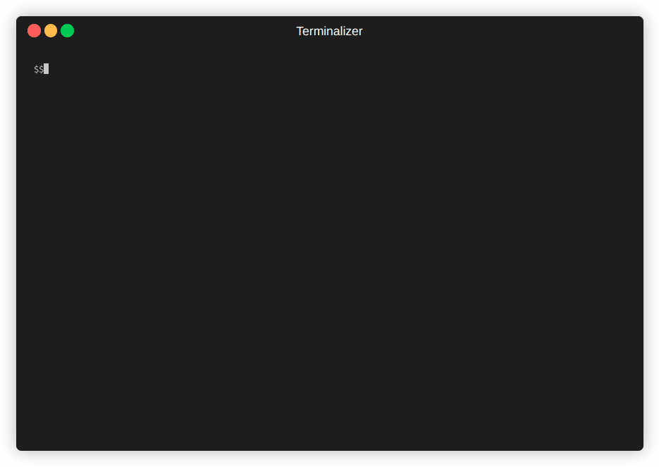
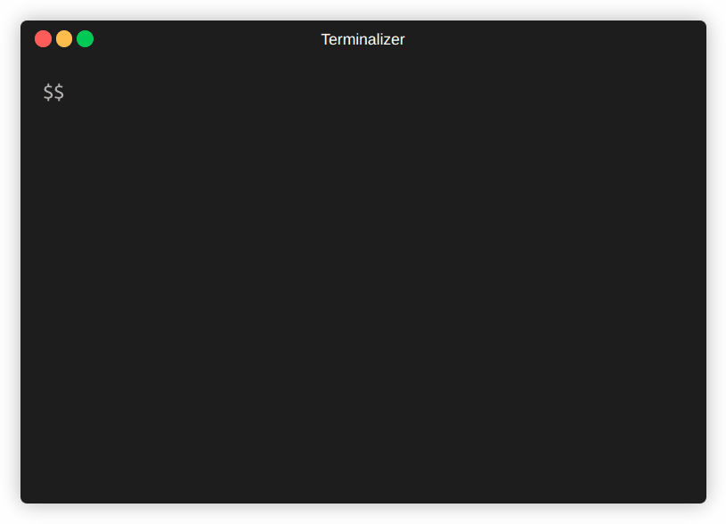
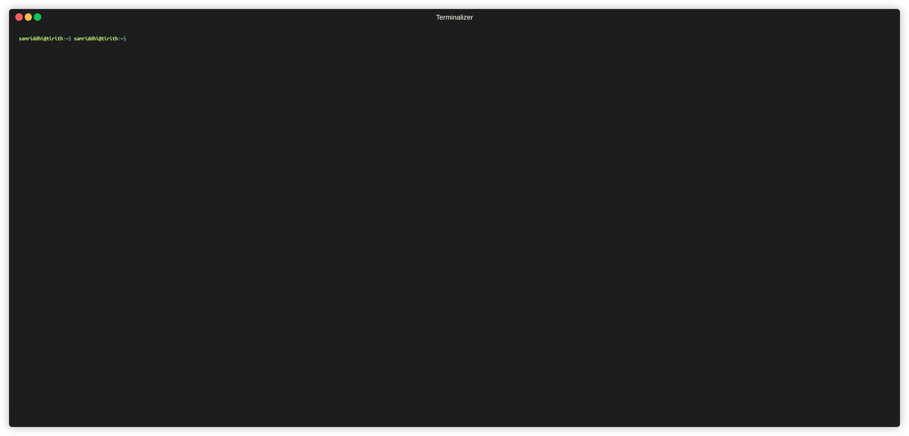
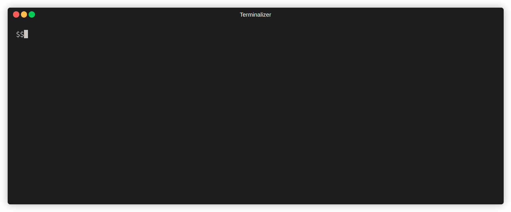

[](code_of_conduct.md)
[](https://github.com/psf/black)
[](https://sonarcloud.io/summary/new_code?id=StackGuardian_policy-framework)
[](https://sonarcloud.io/summary/new_code?id=StackGuardian_policy-framework)
[](https://join.slack.com/t/stackguardian-ol78820/shared_invite/zt-2ksag36j9-OjmXqQmyXudgYrV6FmesIQ)

# Tirith (StackGuardian Policy Framework)

## A call for contributors

We are calling for contributors to help build out new features, review pull requests, fix bugs, and maintain overall code quality. If you're interested, please email us at team[at]stackguardian.io or get started by reading the [contributing.md](./CONTRIBUTING.md).

Tirith scans declarative Infrastructure as Code (IaC) configurations like Terraform against policies defined using JSON.

## Content

<!-- - [Feature Road-Map](#feature-road-map) -->
<!-- - [Local Development Environment](#local-development-environment) -->
- [What is Tirith?](#what-is-tirith)
- [Features](#features)
- [Installation](#installation)
- [Usage](#usage)
- [Example Tirith policies](#example-tirith-policies)
    - [Terraform Plan](#terraform-plan-provider)
    - [Infracost](#infracost-provider)
    - [StackGuardian Workflow Policy](#stackguardian-workflow-policy-using-sg-workflow-provider)
    - [JSON](#json)
    - [Kubernetes](#kubernetes)
- [Getting Started](#getting-started)
- [Want to contribute?](#want-to-contribute)
  - [Getting an issue assigned](#getting-an-issue-assigned)
  - [A bug report](#a-bug-report)
  - [Opening a Pull Request and getting it merged](#opening-a-pull-request-and-getting-it-merged)
- [Submitting a feedback](#submitting-a-feedback)
- [Support](#support)
- [License](#license)

## What is Tirith?

Tirith is a policy framework developed by StackGuardian for enforcing policies on infrastructure configurations such as Terraform, CloudFormation, Kubernetes etc. It simplifies policy creation and enforcement ensuring compliance with infrastructure policies through a user-friendly approach.

## Who is the project for?
- DevSecOps engineers
- Infrastructure architects
- Cloud administrators
- Anyone involved in managing and enforcing infrastructure guardrails


## Why is it important and useful for users?

- **Simplifies Policy Management**: Managing policies in IaC can be complex and costly, requiring multiple codebases. Tirith abstracts these complexities, allowing for centralized and streamlined policy management.
- **Extends Beyond Resource Configurations**: Tirith's policies cover more than just resource configurations, including cost management and CI/CD definitions, offering a comprehensive compliance solution.
- **Cost-Efficient**: Maintaining policies within IaC logic is expensive. Tirith reduces costs by centralizing policy management, eliminating the need for duplicate policies across different IaC codebases.
- **Eases Policy Creation**: Writing Policy as Code is challenging. Tirith simplifies this by providing an intuitive, declarative approach, making it easier to ensure compliance and security.

## Features

- An easy to read and simple way to define policy as code against structured formats.
- Use providers to define policies for terraform plan, infracost or any abstract JSON.
- Easily evaluate inputs against policy using pre-defined evaluators like ContainedIn, Equals, RegexMatch etc.
- Write your own provider (plugin) by leveraging a highly extensible and pluggable architecture to support any input formats.

<!-- ## Feature Road-map

This is only a list of approved features that will be included in Tirith over the next iterations.

- Extended support for Terraform Plan
- Support for Cloudformation and ARM
- Extended library of evaluator functions -->

## Installation

### For users

```
pip install git+https://github.com/StackGuardian/tirith.git
```

### For developers
Here we are going to install Tirith in a Python virtual environment.

1. Clone the Tirith repository to your system
```
git clone https://github.com/StackGuardian/tirith.git
```

2. Change directory to the cloned repository
```
cd tirith
```

3. Setup a virtualenv
```
virtualenv .venv
```

4. Activate the virtualenv
```
source .venv/bin/activate
```

5. Install Tirith in the virtualenv
```
# The -e is optional, just in case you wanna make some changes to the codebase
pip install -e .
```

6. Verify that Tirith is installed

```
tirith --version
1.0.0-beta.12

```

Congratulations! Tirith has been setup in your system

## Usage

```
usage: tirith [-h] [-policy-path PATH] [-input-path PATH] [--json] [--verbose] [--version]

Tirith (StackGuardian Policy Framework)

options:
  -h, --help         show this help message and exit
  -policy-path PATH  Path containing Tirith policy as code
  -input-path PATH   Input file path
  --json             Only print the result in JSON form (useful for passing output to other programs)
  --verbose          Show detailed logs of from the run
  --version          show program's version number and exit

About Tirith:

   * Abstract away the implementation complexity of policy engine underneath.
   * Simplify creation of declarative policies that are easy to read and interpret.
   * Provide a standard framework for scanning various configurations with granularity.
   * Provide modularity to enable easy extensibility
   * Github - https://github.com/StackGuardian/tirith
   * Docs - https://docs.stackguardian.io/docs/tirith/overview
```

## Example Tirith policies

[Examples using various providers](tests/providers)

### Terraform plan provider
<details>

#### Example 1:
VPC and EC2 instance policy

- AWS VPC instance_tenancy is "default"
- EC2 instance cannot be destroyed

```json
{
  "meta": {
    "required_provider": "stackguardian/terraform_plan",
    "version": "v1"
  },
  "evaluators": [
    {
      "id": "check_ec2_tenancy",
      "provider_args": {
        "operation_type": "attribute",
        "terraform_resource_type": "aws_vpc",
        "terraform_resource_attribute": "instance_tenancy"
      },
      "condition": {
        "type": "Equals",
        "value": "default"
      }
    },
    {
      "id": "destroy_ec2",
      "provider_args": {
        "operation_type": "action",
        "terraform_resource_type": "aws_instance"
      },
      "condition": {
        "type": "ContainedIn",
        "value": ["destroy"]
      }
    }
  ],
  "eval_expression": "check_ec2_tenancy && !destroy_ec2"
}
```
Make sure that all `aws_s3_bucket` are referenced by `aws_s3_bucket_intelligent_tiering_configuration` (using Terraform plan provider)

```json
{
  "meta": {
    "required_provider": "stackguardian/terraform_plan",
    "version": "v1"
  },
  "evaluators": [
    {
      "id": "s3HasLifeCycleIntelligentTiering",
      "description": "Make sure all aws_s3_bucket are referenced by aws_s3_bucket_intelligent_tiering_configuration",
      "provider_args": {
        "operation_type": "direct_references",
        "terraform_resource_type": "aws_s3_bucket",
        "referenced_by": "aws_s3_bucket_intelligent_tiering_configuration"
      },
      "condition": {
        "type": "Equals",
        "value": true,
        "error_tolerance": 0
      }
    }
  ],
  "eval_expression": "s3HasLifeCycleIntelligentTiering"
}
```
#### Example 2:
Make sure that all AWS ELBs are attached to security group (using Terraform plan provider)

```json
{
  "meta": {
    "version": "v1",
    "required_provider": "stackguardian/terraform_plan"
  },
  "evaluators": [
    {
      "id": "aws_elbs_have_direct_references_to_security_group",
      "provider_args": {
        "operation_type": "direct_references",
        "terraform_resource_type": "aws_elb",
        "references_to": "aws_security_group"
      },
      "condition": {
        "type": "Equals",
        "value": true,
        "error_tolerance": 0
      }
    }
  ],
  "eval_expression": "aws_elbs_have_direct_references_to_security_group"
}
```
#### Example 3:
Policy:

```json
{
    "meta": {
        "version": "v1",
        "required_provider": "stackguardian/terraform_plan"
    },
    "evaluators": [
        {
            "id": "check1",
            "provider_args": {
                "operation_type": "attribute",
                "terraform_resource_type": "aws_vpc",
                "terraform_resource_attribute": "instance_tenancy"
            },
            "condition": {
                "type": "Equals",
                "value": "default"
            }
        },
        "..."
         {
            "id": "check22",
            "provider_args": {
                "operation_type": "attribute",
                "terraform_resource_type": "aws_vpc",
                "terraform_resource_attribute": "intra_dedicated_network_acl"
            },
            "condition": {
                "type": "Equals",
                "value": false
            }
        }
    ],
    "eval_expression": "check1 && check11 && check111 & check2 & check22"
}

```

Input:

```json
{
    "format_version": "0.1",
    "terraform_version": "0.14.11",
    "variables": {
        "amazon_side_asn": {
            "value": "64512"
        },
        "assign_ipv6_address_on_creation": {
            "value": false
        },
        "azs": {
            "value": []
        },
        "cidr": {
            "value": "10.0.0.0/18"
        },
        "create_database_internet_gateway_route": {
            "value": false
        },

        "..."

         "vpn_gateway_id": {
                    "default": "",
                    "description": "ID of VPN Gateway to attach to the VPC"
                },
                "vpn_gateway_tags": {
                    "default": {},
                    "description": "Additional tags for the VPN gateway"
                }
            }
        }
    
```


Output:


JSON Output:
```json
{
   "final_result": false,
   "evaluators": [
      {
         "id": "check1",
         "passed": true,
         "result": [
            {
               "passed": true,
               "message": "default is equal to default",
               "meta": {
                  "address": "aws_vpc.this[0]",
                  "mode": "managed",
                  "type": "aws_vpc",
                  "name": "this",
                  "index": 0,
                  "provider_name": "registry.terraform.io/hashicorp/aws",
                  "change": {
                     "actions": [
                        "create"
                     ],
                     "before": null,
                     "after": {
                        "assign_generated_ipv6_cidr_block": false,
                        "cidr_block": "10.0.0.0/18",
                        "enable_dns_hostnames": false,
                        "enable_dns_support": true,
                        "instance_tenancy": "default",
                        "tags": {
                           "Name": ""
                        },
                        "tags_all": {}
                     },
                     "after_unknown": {
                        "arn": true,
                        "default_network_acl_id": true,
                        "default_route_table_id": true,
                        "default_security_group_id": true,
                        "dhcp_options_id": true,
                        "enable_classiclink": true,
                        "enable_classiclink_dns_support": true,
                        "id": true,
                        "ipv6_association_id": true,
                        "ipv6_cidr_block": true,
                        "main_route_table_id": true,
                        "owner_id": true,
                        "tags": {},
                        "tags_all": {
                           "Name": true
                        }
                     }
                  }
               }
            },
            {
               "passed": true,
               "message": "default is equal to default",
               "meta": {
                  "address": "aws_vpc.this[0]",
                  "mode": "managed",
                  "type": "aws_vpc",
                  "name": "this",
                  "index": 1,
                  "provider_name": "registry.terraform.io/hashicorp/aws",
                  "change": {
                     "actions": [
                        "create"
                     ],
                     "before": null,
                     "after": {
                        "assign_generated_ipv6_cidr_block": false,
                        "cidr_block": "10.0.0.0/18",
                        "enable_dns_hostnames": false,
                        "enable_dns_support": true,
                        "instance_tenancy": "default",
                        "tags": {
                           "Name": ""
                        },
                        "tags_all": {}
                     },
                     "after_unknown": {
                        "arn": true,
                        "default_network_acl_id": true,
                        "default_route_table_id": true,
                        "default_security_group_id": true,
                        "dhcp_options_id": true,
                        "enable_classiclink": true,
                        "enable_classiclink_dns_support": true,
                        "id": true,
                        "ipv6_association_id": true,
                        "ipv6_cidr_block": true,
                        "main_route_table_id": true,
                        "owner_id": true,
                        "tags": {},
                        "tags_all": {
                           "Name": true
                        }
                     }
                  }
               }
            }
         ],
         "description": null
      },
         "..."    
      {
         "id": "check2",
         "passed": false,
         "result": [
            {
               "message": "attribute: 'intra_acl_tags' is not found",
               "passed": false
            }
         ],
         "description": null
      },
      {
         "id": "check22",
         "passed": false,
         "result": [
            {
               "message": "attribute: 'intra_dedicated_network_acl' is not found",
               "passed": false
            }
         ],
         "description": null
      }
   ],
   "errors": [],
   "eval_expression": "check1 && check11 && check111 & check2 & check22"
}

```
</details>

### Infracost Provider
<details>

Cost control policy

#### Example 1
- EC2 instance cost is lower than 100 USD per month

```json
{
  "meta": {
    "required_provider": "stackguardian/infracost",
    "version": "v1"
  },
  "evaluators": [
    {
      "id": "ec2_cost_below_100_per_month",
      "provider_args": {
        "operation_type": "total_monthly_cost",
        "resource_type": ["aws_ec2"]
      },
      "condition": {
        "type": "LessThanEqualTo",
        "value": 100
      }
    }
  ],
  "eval_expression": "ec2_cost_below_100_per_month"
}
```
#### Example 2
Policy:

```json
{
    "meta": {
        "version": "v1",
        "required_provider": "stackguardian/infracost"
    },
    "evaluators": [
        {
            "id": "cost_check_1",
            "provider_args": {
                "operation_type": "total_monthly_cost",
                "resource_type": [
                    "*"
                ]
            },
            "condition": {
                "type": "LessThanEqualTo",
                "value": 20
            }
        },
        {
            "id": "cost_check_2",
            "provider_args": {
                "operation_type": "total_monthly_cost",
                "resource_type": [
                    "aws_eks_cluster",
                    "aws_s3_bucket"
                ]
            },
            "condition": {
                "type": "LessThanEqualTo",
                "value": -1
            }
        }
    ],
    "eval_expression": "cost_check_1 && cost_check_2"
}
```

Input:

```json
{
  "timeGenerated": "2022-04-03T15:19:53.271995639Z",
  "summary": {
    "totalUnsupportedResources": 0.0,
    "totalUsageBasedResources": 1.0,
    "totalNoPriceResources": 1.0,
    "noPriceResourceCounts": {
      "aws_s3_bucket_public_access_block": 1.0
    },
    "totalDetectedResources": 2.0,
    "totalSupportedResources": 1.0,
    "unsupportedResourceCounts": {}
  },
  "diffTotalHourlyCost": "0",
  "projects": [
    {
      "name": "github.com/StackGuardian/template-tf-aws-s3-demo-website/tf_plan.json",
      "pastBreakdown": {

        ...
        }
}],
    "pastTotalHourlyCost": "0",
    "totalMonthlyCost": "100",
    "diffTotalMonthlyCost": "0",
    "currency": "USD",
    "totalHourlyCost": "0",
    "pastTotalMonthlyCost": "0",
    "version": "0.2"
  }

```

Output:


JSON Output:
```json
{
   "meta": {
      "version": "v1",
      "required_provider": "stackguardian/infracost"
   },
   "final_result": false,
   "evaluators": [
      {
         "id": "cost_check_1",
         "passed": false,
         "result": [
            {
               "passed": false,
               "message": "300.1 is not less than or equal to 20",
               "meta": null
            }
         ],
         "description": null
      },
      {
         "id": "cost_check_2",
         "passed": false,
         "result": [
            {
               "passed": false,
               "message": "100.1 is not less than or equal to -1",
               "meta": null
            }
         ],
         "description": null
      }
   ],
   "errors": [],
   "eval_expression": "cost_check_1 && cost_check_2"
}
```
</details>

### StackGuardian Workflow Policy (using SG workflow provider)
<details>
- Terraform Workflow should require an approval to create or destroy resources

```json
{
  "meta": {
    "required_provider": "stackguardian/sg_workflow",
    "version": "v1"
  },
  "evaluators": [
    {
      "id": "require_approval_before_creating_ec2",
      "provider_args": {
        "operation_type": "attribute",
        "workflow_attribute": "approvalPreApply"
      },
      "condition": {
        "type": "Equals",
        "value": true
      }
    }
  ],
  "eval_expression": "require_approval_before_creating_ec2"
}
```

#### Example 2

Policy:

```json
{
    "meta": {
        "version": "v1",
        "required_provider": "stackguardian/sg_workflow"
    },
    "evaluators": [
        {
            "id": "wf_check_1",
            "provider_args": {
                "operation_type": "attribute",
                "workflow_attribute": "useMarketplaceTemplate"
            },
            "condition": {
                "type": "Equals",
                "value": true
            }
        },
        "..."
          {
            "id": "wf_check_14",
            "provider_args": {
                "operation_type": "attribute",
                "workflow_attribute": "iacTemplateId"
            },
            "condition": {
                "type": "Equals",
                "value": "/stackguardian/s3-website:19"
            }
        }
    ],
    "eval_expression": "wf_check_1 && wf_check_2 && wf_check_3 && wf_check_4 && wf_check_5 && wf_check_6 && wf_check_7 && wf_check_8 && wf_check_9 && wf_check_10 && wf_check_11 && wf_check_12 && wf_check_13 && wf_check_14"
}
```

Example Input:

```json
{
 "DeploymentPlatformConfig": [
  {
   "config": {
    "integrationId": "/integrations/aws-qa"
   },
   "kind": "AWS_RBAC"
  }
 ],
 "Description": "test",
 "DocVersion": "V3.BETA",
 "EnvironmentVariables": [
  {
   "config": {
    "textValue": "eu-central-1",
    "varName": "AWS_DEFAULT_REGION"
   }}]
   "..."
   {
   "schemaType": "FORM_JSONSCHEMA"
  },
  "iacVCSConfig": {
   "iacTemplateId": "/stackguardian/s3-website:19",
   "useMarketplaceTemplate": true
  },
 
 "WfStepsConfig": [],
 "WfType": "TERRAFORM",
 "_SGInternals": {}
}
```

Output:



JSON Output:

```json 

{
   "meta": {
      "version": "v1",
      "required_provider": "stackguardian/sg_workflow"
   },
   "final_result": false,
   "evaluators": [
      {
         "id": "wf_check_1",
         "passed": true,
         "result": [
            {
               "passed": true,
               "message": "True is equal to True",
               "meta": null
            }
         ],
         "description": null
        
      },
     
 "..."

      {
         "id": "wf_check_11",
         "passed": false,
         "result": [
            {
               "passed": false,
               "message": "True is not equal to False",
               "meta": null
            }
         ],
         "description": null
      },

   ],
   "errors": [],
   "eval_expression": "wf_check_1 && wf_check_2 && wf_check_3 && wf_check_4 && wf_check_5 && wf_check_6 && wf_check_7 && wf_check_8 && wf_check_9 && wf_check_10 && wf_check_11 && wf_check_12 && wf_check_13 && wf_check_14"
}
```
</details>

### JSON
<details>
Example Policy

```json
{
    "meta": {
        "version": "v1",
        "required_provider": "stackguardian/json"
    },
    "evaluators": [
        {
            "id": "check0",
            "provider_args": {
                "operation_type": "get_value",
                "key_path": "z.b"
            },
            "condition": {
                "type": "LessThanEqualTo",
                "value": 1,
                "error_tolerance": 2
            }
        },
        {
            "id": "check1",
            "provider_args": {
                "operation_type": "get_value",
                "key_path": "a.b"
            },
            "condition": {
                "type": "LessThanEqualTo",
                "value": 1
            }
        },
        {
            "id": "check2",
            "provider_args": {
                "operation_type": "get_value",
                "key_path": "c"
            },
            "condition": {
                "type": "Contains",
                "value": "aa"
            }
        },
        {
            "id": "check3",
            "provider_args": {
                "operation_type": "get_value",
                "key_path": "nested_map.e.f"
            },
            "condition": {
                "type": "Equals",
                "value": "3"
            }
        },
        {
            "id": "check4",
            "provider_args": {
                "operation_type": "get_value",
                "key_path": "list_of_dict.*.key1"
            },
            "condition": {
                "type": "Equals",
                "value": "value1"
            }
        },
        {
            "id": "check5",
            "provider_args": {
                "operation_type": "get_value",
                "key_path": "nested_map"
            },
            "condition": {
                "type": "Equals",
                "value": { "e": { "f": "3" } }
            }
        }
    ],
    "eval_expression": "check1 && check2 && check3 && check4 && check5"
}
```

Example Input
```json
{
	"a": {
			"b": 1
		},
	"c": ["aa", "bb"],
	"nested_map": {
		"e": {
			"f": "3"
		}
	},
	"list_of_dict": [
		{
			"key1": "value1"
		},
		{
			"key1": "value1"
		}
	]
}
```

Output:


JSON Output
```json
{
   "meta": {
      "version": "v1",
      "required_provider": "stackguardian/json"
   },
   "final_result": true,
   "evaluators": [
      {
         "id": "check0",
         "passed": null,
         "result": [
            {
               "message": "key_path: `z.b` is not found (severity: 2)",
               "passed": null
            }
         ],
         "description": null
      },
      {
         "id": "check1",
         "passed": true,
         "result": [
            {
               "passed": true,
               "message": "1 is less than equal to 1",
               "meta": null
            }
         ],
         "description": null
      },
      {
         "id": "check2",
         "passed": true,
         "result": [
            {
               "passed": true,
               "message": "Found aa inside ['aa', 'bb']",
               "meta": null
            }
         ],
         "description": null
      },
      {
         "id": "check3",
         "passed": true,
         "result": [
            {
               "passed": true,
               "message": "3 is equal to 3",
               "meta": null
            }
         ],
         "description": null
      },
      {
         "id": "check4",
         "passed": true,
         "result": [
            {
               "passed": true,
               "message": "value1 is equal to value1",
               "meta": null
            },
            {
               "passed": true,
               "message": "value1 is equal to value1",
               "meta": null
            }
         ],
         "description": null
      },
      {
         "id": "check5",
         "passed": true,
         "result": [
            {
               "passed": true,
               "message": "{'e': {'f': '3'}} is equal to {'e': {'f': '3'}}",
               "meta": null
            }
         ],
         "description": null
      }
   ],
   "errors": [],
   "eval_expression": "check1 && check2 && check3 && check4 && check5"
```
</details>

### Kubernetes
<details>

Kubernetes (using Kubernetes provider)
#### Example 1
- Make sure that all pods have a liveness probe defined

```json
{
  "meta": {
    "version": "v1",
    "required_provider": "stackguardian/kubernetes"
  },
  "evaluators": [
    {
      "id": "kinds_have_null_liveness_probe",
      "provider_args": {
        "operation_type": "attribute",
        "kubernetes_kind": "Pod",
        "attribute_path": "spec.containers.*.livenessProbe"
      },
      "condition": {
        "type": "Contains",
        "value": null,
        "error_tolerance": 2
      }
    }
  ],
  "eval_expression": "!kinds_have_null_liveness_probe"
}
```
#### Example 2

Example Policy:

```json
{
  "meta": {
    "version": "v1",
    "required_provider": "stackguardian/kubernetes"
  },
  "evaluators": [
    {
      "id": "kinds_have_null_liveness_probe",
      "provider_args": {
        "operation_type": "attribute",
        "kubernetes_kind": "Pod",
        "attribute_path": "spec.containers.*.livenessProbe"
      },
      "condition": {
        "type": "Contains",
        "value": null,
        "error_tolerance": 2
      }
    }
  ],
  "eval_expression": "!kinds_have_null_liveness_probe"
}
```

Example Input:

```yml
apiVersion: v1
kind: ServiceAccount
metadata:
  name: wfs-demp-wfs-demo
  labels:
    helm.sh/chart: wfs-demo-0.1.0
    app.kubernetes.io/name: wfs-demo
    app.kubernetes.io/instance: wfs-demp
    app.kubernetes.io/version: "1.16.0"
    app.kubernetes.io/managed-by: Helm
---
# Source: wfs-demo/templates/user-acces.yaml
apiVersion: rbac.authorization.k8s.io/v1
...
    - name: wget
      image: busybox
      command: ['wget']
      args: ['wfs-demp-wfs-demo:80']
      livenessProbe:
        exec:
          command:
          - cat
          - /tmp/healthy
        initialDelaySeconds: 5
        periodSeconds: 5
  restartPolicy: Never

```

Output:


JSON Output:
```json
{
   "meta": {
      "version": "v1",
      "required_provider": "stackguardian/kubernetes"
   },
   "final_result": false,
   "evaluators": [
      {
         "id": "kinds_have_null_liveness_probe",
         "passed": true,
         "result": [
            {
               "passed": true,
               "message": "Found None inside [None, {'exec': {'command': ['/tmp/healthy', 'cat']}, 'initialDelaySeconds': 5, 'periodSeconds': 5}]",
               "meta": null
            }
         ],
         "description": null
      }
   ],
   "errors": [],
   "eval_expression": "!kinds_have_null_liveness_probe"
}
```

</details>
<!-- ## Local Development Environment

- [Python 3.6 or higher](https://www.python.org/downloads/) is required.
- [pip](https://pip.pypa.io/en/stable/) is required. -->

<!-- ## Publish Package on test.pypi.org
* Use the following command to install the latest version of the setuptools package.
  ```
    python -m pip install --user --upgrade setuptools
  ```

* Make sure you are at the same directory where setup.py is located and run this command.
  ```
    python setup.py sdist
  ```
* Visit <a href="https://test.pypi.org/">test.pypi.org</a> and create a new account if not already.
* Install Twine package using following command.
  ```
    pip install twine
  ```
* Upload you package to test.pypi using following command.
  ```
    twine upload --repository-url https://test.pypi.org/legacy/ dist/*
  ``` -->
## Getting Started

create two files, one for input.json one for
policy.json.

**input.json**

```json
{
  "path": "/stackguardian/wfgrps/test",
  "verb": "POST",
  "meta": {
    "epoch": 1718860398,
    "User-Agent": {
        "name": "User-Agent",
        "value": "PostmanRuntime/7.26.8"
    }
  }
}
```

**policy.json**

```json
{
    "meta": {
        "version": "v1",
        "required_provider": "stackguardian/json"
    },
    "evaluators": [
        {
            "id": "can_post",
            "provider_args": {
                "operation_type": "get_value",
                "key_path": "verb"
            },
            "condition": {
                "type": "Equals",
                "value": "POST"
            }
        },
        {
            "id": "wfgrps_path",
            "provider_args": {
                "operation_type": "get_value",
                "key_path": "path"
            },
            "condition": {
                "type": "RegexMatch",
                "value": "/stackguardian/wfgrps/test.*"
            }
        },
        {
            "id": "epoch_less_than_8th_july_2024",
            "provider_args": {
                "operation_type": "get_value",
                "key_path": "meta.epoch"
            },
            "condition": {
                "type": "LessThan",
                "value": 1720415598
            }
        }
    ],
    "eval_expression": "can_post && wfgrps_path && epoch_less_than_8th_july_2024"
}
```

### Evaluating the policy against the input

To evaluate the policy against the input, run the following command:

```sh
tirith -input-path input.json -policy-path policy.json
```

Explanation:

-   **tirith**:
    -   This is the command to run the Tirith program, which is part of
         the StackGuardian Policy Framework.

-   **-input-path input.json**:
    -   The -input-path option specifies the path to the input file.
    -   input.json is the file that contains the input data to be
         scanned by Tirith.

-   **-policy-path policy.json**:
    -   The -policy-path option specifies the path to the policy file.
    -   policy.json is the file that contains the policies (rules)
         defined in Tirith\'s policy as code.

It should print:
```
Check: can_post
  PASSED
  Results:
	1. PASSED: POST is equal to POST

Check: wfgrps_path
  PASSED
  Results:
	1. PASSED: /stackguardian/wfgrps/test matches regex pattern /stackguardian/wfgrps/test.*

Check: epoch_less_than_8th_july_2024
  PASSED
  Results:
	1. PASSED: 1718860398 is less than 1720415598

Passed: 3 Failed: 0 Skipped: 0

Final expression used:
-> can_post && wfgrps_path && epoch_less_than_8th_july_2024
✔ Passed final evaluator
```


### Error tolerance

What if sometimes one or more keys inside the input file are not found?
Let's try to delete the **verb** key inside the **input.json** and see
what happens when we try to run the evaluation again using the same
command above.

It should fail the evaluation.

What if we, as a user, want the evaluator to "skips" itself (don't
include the result to the final evaluator) when a particular key is not
found?

This is when **error tolerance** can be helpful.

A provider can raise an error and the error itself has a **severity**
value. (see Appendix). In this case the JSON provider raises an error of
severity value 2 when the `get_value` operation can't find the JSON
path inside the input.

By setting the **error_tolerance** value to 2 or more inside the
**condition** key in the evaluator, it will mark the evaluator as Skipped instead of Failed.


## Want to contribute?

If you're interested, please email us at team[at]stackguardian.io or get started by reading the [contributing.md](./CONTRIBUTING.md).

### Getting an issue assigned

Go to the <a href="https://github.com/StackGuardian/tirith">Tirith Repository</a> and in the <a href="https://github.com/stackguardian/tirith/issues">issues</a> tab describe any bug or feature you want to add. If found relevant, the maintainers will assign the issue to you and you may start working on it as mentioned in the next section.

<p>The kinds of issues a contributor can open:</p>
 <ul>
	<li>Report Bugs</li>
	<li>Feature Enhancement</li>
	<li>If any "help" is needed with using Tirith</li>
 </ul>

### A bug report

Head over to the <a href="https://github.com/StackGuardian/tirith">Tirith repository</a> and in the <a href="https://github.com/stackguardian/tirith/issues">issues</a> tab describe the bug you encountered and we will be happy to take a look into it.

### Opening a Pull Request and getting it merged?

1.  Go to the <a href ="https://github.com/StackGuardian/tirith">repository</a> and fork it.
2.  Clone the repository in your local machine.
3.  Open your terminal and `cd tirith`
4.  Create your own branch to work on the changes you intend to perform. For e.g. if you want some changes or bug fix to any function in the evaluators, name your branch with something relevant like, `git branch bug-fix-equals-evaluator`
5.  After necessary changes, `git push --set-upstream origin bug-fix-equals-evaluator`, `git checkout main` and `git merge bug-fix-equals-evaluator` or use the GUI to create a "Pull Request" after pushing it in the respective branch.
6.  A review request will be sent to the repository maintainers and your changes will be merged if found relevant.

## Submitting a Feedback

Wanna submit a feedback? It's as simple as writing and posting it in the <a href="https://github.com/StackGuardian/feedback/discussions/8">feedback section</a>.

<p>Your feedback will help us improve</p>

## Support

## License

<i>Apache License 2.0</i>

<p>The Apache License is a permissive free software license written by the Apache Software Foundation (ASF). It allows all users to use the software for any purpose, to distribute it, to modify it, and to distribute modified versions of the software under the terms of the license, without concern for royalties.</p>
