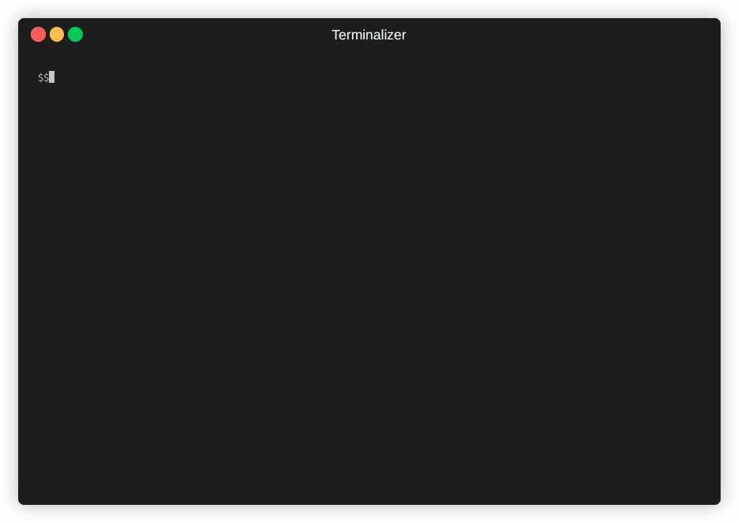
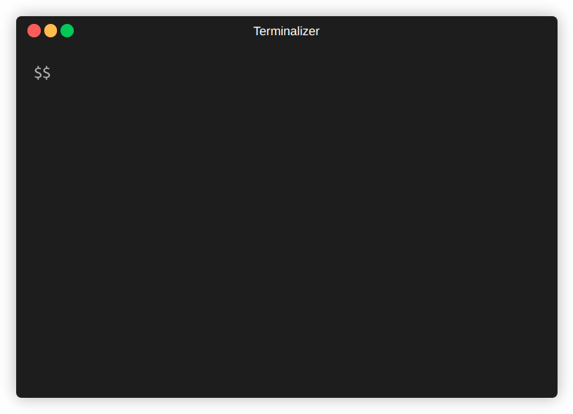
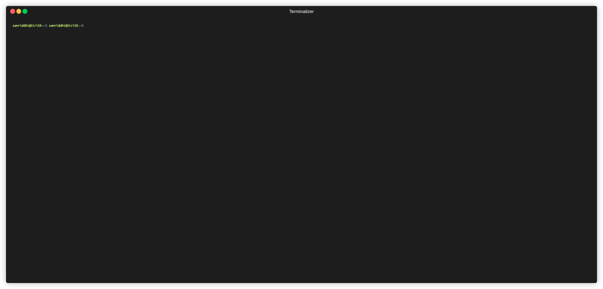
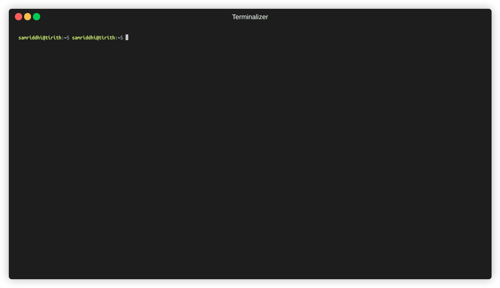

[](LICENSE)
[](CODE_OF_CONDUCT.md)
[](https://github.com/psf/black)
[](https://sonarcloud.io/summary/new_code?id=StackGuardian_policy-framework)
[](https://sonarcloud.io/summary/new_code?id=StackGuardian_policy-framework)
[](https://join.slack.com/t/stackguardian-ol78820/shared_invite/zt-2ksag36j9-OjmXqQmyXudgYrV6FmesIQ)
[](https://codecov.io/gh/StackGuardian/tirith)

# Tirith — IaC Governance plugin

**Plugin IaC Governance for any pipeline, running anywhere.** Evaluate plans with Tirith, protect
sensitive values, enforce centralised governance, and surface actionable results before
infrastructure changes are applied.

Tirith reads the plan your pipeline already produces — the output of `terraform show -json tfplan` —
checks it against your policies, and exits non-zero so a violating change never reaches `apply`. The
reason it is a plugin rather than an integration is that one policy set then covers every pipeline
you run it from: the same policy files gate a GitHub Actions job, a GitLab job and a laptop, and in
platform mode Tirith rules and Checkov findings come back in one verdict instead of two tools you
have to reconcile by hand.

It is Apache-2.0 and needs no account. Policies are JSON files in your repository, evaluation happens
on your own runner, and nothing is sent anywhere. If you would rather keep policy in one place across
many repositories, `tirith platform check` evaluates against the policies a
[StackGuardian](https://www.stackguardian.io/) organization enforces instead — same document, same
verdict, same exit codes. That mode is optional and is the only part that talks to a network.

## Content

- [What is Tirith?](#what-is-tirith)
- [Features](#features)
- [Installation](#installation)
- [Usage](#usage)
- [The interactive interface](#the-interactive-interface)
    - [Explorer](#explorer)
    - [Builder](#builder)
    - [Playground](#playground)
    - [Serving it on a port](#serving-it-on-a-port)
- [Run it in CI](#run-it-in-ci)
- [Exit codes](#exit-codes)
- [Evaluating against your StackGuardian organization](#evaluating-against-your-stackguardian-organization)
- [Example Tirith policies](#example-tirith-policies)
    - [error_tolerance](#error_tolerance-and-the-third-outcome)
    - [Terraform Plan](#terraform-plan-provider)
    - [Infracost](#infracost-provider)
    - [StackGuardian Workflow Policy](#stackguardian-workflow-policy-using-sg-workflow-provider)
    - [JSON](#json)
    - [Kubernetes](#kubernetes)
- [Getting Started](#getting-started)
- [Want to contribute?](#want-to-contribute)
  - [Getting an issue assigned](#getting-an-issue-assigned)
  - [A bug report](#a-bug-report)
  - [Opening a Pull Request and getting it merged](#opening-a-pull-request-and-getting-it-merged)
- [Submitting a feedback](#submitting-a-feedback)
- [Support](#support)
- [License](#license)

## What is Tirith?

Tirith turns a declarative policy — a JSON file, not a program — into a pass or fail verdict on a
concrete infrastructure change. Point it at a terraform plan, a terraform state file, a Kubernetes
manifest, an Infracost breakdown or any JSON document, and it reports which rules passed, which
failed, and on which resource and value.

## Who is the project for?
- DevSecOps engineers
- Infrastructure architects
- Cloud administrators
- Anyone involved in managing and enforcing infrastructure guardrails


## Why is it important and useful for users?

- **Simplifies Policy Management**: Managing policies in IaC can be complex and costly, requiring multiple codebases. Tirith abstracts these complexities, allowing for centralized and streamlined policy management.
- **Extends Beyond Resource Configurations**: Tirith's policies cover more than just resource configurations, including cost management and CI/CD definitions, offering a comprehensive compliance solution.
- **Cost-Efficient**: Maintaining policies within IaC logic is expensive. Tirith reduces costs by centralizing policy management, eliminating the need for duplicate policies across different IaC codebases.
- **Eases Policy Creation**: Writing Policy as Code is challenging. Tirith simplifies this by providing an intuitive, declarative approach, making it easier to ensure compliance and security.

## Features

- An easy to read and simple way to define policy as code against structured formats.
- Use providers to define policies for terraform plan, infracost or any abstract JSON.
- Easily evaluate inputs against policy using pre-defined evaluators like ContainedIn, Equals, RegexMatch etc.
- Write your own provider (plugin) by leveraging a highly extensible and pluggable architecture to support any input formats.


## Installation

### For users

```
pip install git+https://github.com/StackGuardian/tirith.git
```

Pin a tag rather than tracking the default branch, so a CI job cannot change behaviour underneath you:

```
pip install "git+https://github.com/StackGuardian/tirith.git@1.0.5"
```

`1.0.5` is the newest tag; `git ls-remote --tags https://github.com/StackGuardian/tirith.git` lists
them. Tirith is not on PyPI — `pip install tirith` installs an unrelated project of the same name, so
install from git. Python 3.8 or newer.

### For developers

#### Running the Dev Container

- Clone the repository to your local machine:

```bash
   git clone https://github.com/StackGuardian/tirith.git
   cd tirith
```

- Start the Docker Engine using docker desktop or CLI.

- Open the project folder in Visual Studio Code

- Once inside VS Code, open the Command Palette `(Ctrl+Shift+P or Cmd+Shift+P on macOS)` and search for **Dev Containers: Rebuild and Reopen in Container**. Select this option.

- VS Code will build the dev container based on the devcontainer.json file or Docker configuration provided in the project. This may take a few minutes.

- Once the container is up, you will have a fully configured development environment running inside Docker.

Reference Links: 

https://code.visualstudio.com/docs/devcontainers/create-dev-container#_create-a-devcontainerjson-file

https://code.visualstudio.com/docs/devcontainers/containers#_managing-containers


#### Manual Installation
Here we are going to install Tirith in a Python virtual environment.

1. Clone the Tirith repository to your system
```
git clone https://github.com/StackGuardian/tirith.git
```

2. Change directory to the cloned repository
```
cd tirith
```

3. Setup a virtualenv
```
virtualenv .venv
```

4. Activate the virtualenv
```
source .venv/bin/activate
```

5. Install Tirith in the virtualenv
```
# The -e is optional, just in case you wanna make some changes to the codebase
pip install -e .
```

6. Verify that Tirith is installed

```
tirith --version
tirith 1.2.0
```

Congratulations! Tirith has been setup in your system

## Usage

```
usage: tirith [-h] [-policy-path PATH] [-input-path PATH] [-var-path PATH]
              [-var PATH] [--json] [--verbose] [--fail-on-error] [--version]

Tirith (StackGuardian Policy Framework)

options:
  -h, --help         show this help message and exit
  -policy-path PATH  Path containing Tirith policy as code
  -input-path PATH   Input file path
  -var-path PATH     Variable file path(s)
  -var PATH          Inline variable(s)
  --json             Only print the result in JSON form (useful for passing output to other programs)
  --verbose          Show detailed logs of from the run
  --fail-on-error    Exit 3 when a policy fails, instead of 0. Off by default for compatibility.
  --version          show program's version number and exit

Subcommands:

   tirith platform check --help   Evaluate against the policies your StackGuardian
                                  organization enforces, rather than local files.
   tirith ui --help               Explore results, build policies and experiment in
                                  an interactive interface. Needs the 'tui' extra.

About Tirith:

   * Abstract away the implementation complexity of policy engine underneath.
   * Simplify creation of declarative policies that are easy to read and interpret.
   * Provide a standard framework for scanning various configurations with granularity.
   * Provide modularity to enable easy extensibility
   * Github - https://github.com/StackGuardian/tirith
   * Docs - https://github.com/StackGuardian/tirith#readme
```


## The interactive interface

`tirith ui` opens a terminal interface with three tabs: an **Explorer** for reading results, a
**Builder** for assembling policies, and a **Playground** for experimenting.

It is an optional extra, because tirith's main job is to be a dependency-light CI gate and
nobody gating a pipeline should pay to install an interface they never open. It needs Python
3.9 or newer, while tirith itself still supports 3.8:

```bash
pip install 'py-tirith[tui]'
```

```bash
tirith ui                                          # playground, with worked examples
tirith ui --policy policy.json --input plan.json   # evaluate yours, open on the results
tirith ui --result result.json                     # an evaluation you already ran
tirith --json -policy-path p.json -input-path plan.json | tirith ui --result -
```

Naming both a policy and an input evaluates them and opens the **Explorer**, because that is
what you came to see. With only a policy, or nothing at all, it opens the Playground.

### Explorer

The output of `--json` and the pretty printer both tell you *that* a check failed. Neither
tells you *which resource* failed it — although the result document has carried the resource's
address, its planned action and its before/after values all along.

The Explorer shows them. Selecting a failing result names the resource
(`aws_db_instance.primary`), the action in terraform's own vocabulary (**replace (destroy
first)** — distinct from create-first, because only one of them means downtime), and the
attributes that changed, including the ones that are unknown until apply.

This matters most on a wildcard policy, where every message reads identically
(`` `"product-456"` is not empty ``) and only the address distinguishes one row from another.

Three ways to get your own results in front of it:

```bash
# 1. Evaluate now. Opens on the Explorer with the first failure selected.
tirith ui --policy policy.json --input plan.json

# 2. A result you saved earlier -- a CI artifact, a colleague's run.
tirith --json -policy-path policy.json -input-path plan.json > result.json
tirith ui --result result.json

# 3. Straight off a pipe, without the intermediate file.
tirith --json -policy-path policy.json -input-path plan.json | tirith ui --result -
```

The pipe needs a terminal to run in, since it is an interactive interface: if stdin is a pipe
and there is no terminal behind it — a CI job with output redirected — it says so instead of
starting and immediately exiting. `--serve` cannot read stdin at all, because the served
interface is a separate process with its own; pass it a file path.

### Builder

Pick a provider, an operation and a condition; the form's fields change to whatever that
operation actually accepts, and the policy JSON is generated as you go. The provider argument
names are not guessable — `stackguardian/json` reads `key_path` while
`stackguardian/kubernetes` reads `attribute_path`, and the terraform provider alone has seven
operations taking different arguments — so the form exists to stop you writing a policy that
parses cleanly and silently matches nothing.

Values keep their JSON types: typing `true` gives you a boolean, `["a","b"]` a list, and
`production` the string, because `Equals: "true"` and `Equals: true` are different questions.

**How the checks combine** is its own field, holding the policy's `eval_expression`:

| | |
| --- | --- |
| `a && b` | both must pass |
| `a \|\| b` | either may pass |
| `!a` | passes when the check *fails* — how you write a detector |
| `(a \|\| b) && c` | grouping |

It fills itself in with every check `&&`-ed together, and stops doing that the moment you edit
it. The expression is the one part of a policy that cannot be derived from the checks, so
regenerating it after you have written `a && !b` would throw away the only thing you could not
have expressed any other way.

The form also names the document each provider expects, because choosing a provider is
choosing what you have to feed it.

### Playground

Load one of the bundled examples, change something, watch the verdict move. Evaluation runs as
you type. Broken JSON, a half-written policy and a provider that raises are all reported in the
findings pane rather than as a traceback — while you are editing, the broken state is the
normal state.

The examples are worked lessons rather than fixtures. Most of them fail on purpose, and each
one's notes explain the mechanism it demonstrates and what to try next:

| Example | Demonstrates |
| --- | --- |
| Required tags | One check, one condition, nested attributes. Why `error_tolerance` can turn a failure into a *skip* — and why a skip is not a pass. |
| No public buckets | Two checks joined with `&&`; two buckets, one at fault. |
| Cost ceiling | The infracost provider, and why a misspelled resource type sums to `0` and fails open. |
| Block destroy | A database being replaced inside a routine plan, and the attribute that forced it. |
| Kubernetes probes | Wildcard paths, why `IsNotEmpty` is the wrong question over a list, and the `!` operator. |

### Serving it on a port

The same interface runs in a browser, which is useful for sharing a result with someone who
does not have tirith installed:

```bash
tirith ui --serve --port 8000     # then open http://localhost:8000
```

It is the same interface relayed to the browser, not a second web-only implementation, so it
behaves identically and there is nothing extra to keep in sync.

Bind address and port are yours to choose, but note the served interface can read any file path
the serving process can. Keep it on `localhost` unless you have a reason not to.

## Run it in CI

### GitHub Actions

Use [StackGuardian/tirith-iac-governance-action](https://github.com/StackGuardian/tirith-iac-governance-action).
It finds the plan, posts a sticky pull-request comment, creates a check run and sets the job's exit
code:

```yaml
- run: terraform show -json tfplan > plan.json
- uses: StackGuardian/tirith-iac-governance-action@v2
```

With a `plan.json` in the working directory that is the whole integration — no `with:` block. Add
`with: { fail-on-error: true }` to make a failing policy fail the job, and see the action's own README
for the rest of its inputs.

### GitLab, or any container-based CI

There is no GitLab-native equivalent of the action, so you invoke the CLI directly — which is all the
action does underneath. Given an earlier job that saved `plan.json` as an artifact:

```yaml
policy:
  image: python:3.12
  needs: [plan]
  script:
    - pip install "git+https://github.com/StackGuardian/tirith.git@1.0.5"
    - tirith -policy-path .tirith/policies -input-path plan.json --fail-on-error
```

Swap the last line for `tirith platform check --workflow-id my-repo --input-path plan.json
--fail-on-error` to use your organization's policies instead of the committed files. Nothing here is
GitLab-specific: any runner that can execute a container and produce a plan works the same way.

## Exit codes

| Code | Meaning |
|---|---|
| 0 | Policies passed, or nothing was in scope to gate on |
| 1 | Tirith could not complete the evaluation — bad input, a policy it could not evaluate, unreachable API |
| 2 | Timed out waiting for a StackGuardian run |
| 3 | A policy failed. Only with `--fail-on-error`, on either surface |
| 130 | Interrupted |

**Gate a CI job with `--fail-on-error`:**

```
tirith -policy-path .tirith/policies -input-path plan.json --fail-on-error
echo $?    # 3 a policy failed · 1 nothing could be evaluated · 0 everything passed
```

Without the flag the exit code is always `0` and the verdict is in the output — that is how the
command has always behaved, and it is left alone so upgrading cannot turn a passing pipeline red.

**`3` is deliberately not `1`.** `3` means a check ran and said no. `1` means Tirith could not tell you
either way — an unparseable `eval_expression`, an unresolved variable, or a policy whose every check was
skipped. A job that treats every non-zero code alike reports an outage as a policy violation, and
cannot tell a working gate from a broken one.

One limit worth stating plainly: a *misconfigured* policy — an unsupported `condition.type`, an unknown
`required_provider` — comes back from the engine as an ordinary failed check with no error attached, so
it is indistinguishable from a real violation and exits `3`. It fails closed, which is the safe
direction, but it will point at your infrastructure when the fault is in the policy.

## Evaluating against your StackGuardian organization

`tirith platform check` evaluates against the policies your StackGuardian organization enforces,
instead of policy files committed to your repository — so policy lives in one place rather than being
copied into every repository that needs gating.

```
export SG_API_TOKEN=sgo_...        # an organization token
export SG_ORG=my-org

tirith platform check --workflow-id my-repo --input-path plan.json --fail-on-error
```

It masks the document on your machine before anything leaves it, packs it with your terraform source,
uploads it, runs the policies on StackGuardian, and prints the verdict. `--input-path` is optional
when a `plan.json` or `tfplan.json` is in the working directory.

Common flags:

| | |
|---|---|
| `--region {eu,us}` | Which StackGuardian region. Default `eu`, or `$SG_REGION` |
| `--api-key -` | Read the key from stdin instead of the environment |
| `--plan-file tfplan` | The binary plan from `terraform plan -out=`, rendered through `terraform show -json` in memory. Use `--input-path` if you already have the JSON |
| `--state-path` / `--infracost-path` | Add a state document or a cost breakdown to the evaluation |
| `--no-source` | Do not upload the terraform source. Discovery still looks in `--source-dir` for the plan |
| `--fail-on-error` | Exit `3` when a policy fails, instead of `0` |
| `--output-json` / `--output-markdown` | Write the verdict to files for a later CI step |

`--api-url` overrides `--region` for a self-hosted or dedicated host. Every flag is in
[docs/platform-check.md](docs/platform-check.md) or `tirith platform check --help`.

Running this from GitHub Actions? Use [the action](#github-actions) instead — it wires up the plan
discovery, the sticky pull-request comment, the check run and the exit codes for you.

## Example Tirith policies

[Examples using various providers](tests/providers)

### `error_tolerance`, and the third outcome

Every `condition` takes an `error_tolerance`, and it appears in most of the examples below without
being explained. It is a severity threshold for *problems reading the input*, not for policy failures:

- **`0`** — anything the provider could not read is an error, and the check **fails**.
- **`1` or higher** — a problem whose severity is at or below the tolerance is *skipped* instead. A
  missing attribute has severity 2, so `error_tolerance: 2` turns "this key is not in the plan" from a
  failure into a non-answer.

That third outcome is why some sample output below shows `"passed": null` rather than `true` or
`false` — the check did not pass and did not fail, it never ran. A skipped check is then **removed from
`eval_expression`** before it is evaluated, because `None` is falsy in Python and leaving it in would
silently read as a failure.

One consequence worth knowing before using it: a policy whose every check is skipped has evaluated
nothing at all, and reports `"final_result": null` rather than `true` or `false`. With
`--fail-on-error` that exits **1**, not 0 and not 3 — a check that looked at nothing is not a pass, and
it is not a violation either. Keep the tolerance at `0` if you would rather such a policy fail outright.

### Terraform plan provider
<details>
<summary>Terraform plan provider — example policies and output</summary>

#### Example 1:
VPC and EC2 instance policy

- AWS VPC instance_tenancy is "default"
- EC2 instance cannot be destroyed

```json
{
  "meta": {
    "required_provider": "stackguardian/terraform_plan",
    "version": "v1"
  },
  "evaluators": [
    {
      "id": "check_ec2_tenancy",
      "provider_args": {
        "operation_type": "attribute",
        "terraform_resource_type": "aws_vpc",
        "terraform_resource_attribute": "instance_tenancy"
      },
      "condition": {
        "type": "Equals",
        "value": "default"
      }
    },
    {
      "id": "destroy_ec2",
      "provider_args": {
        "operation_type": "action",
        "terraform_resource_type": "aws_instance"
      },
      "condition": {
        "type": "ContainedIn",
        "value": ["destroy"]
      }
    }
  ],
  "eval_expression": "check_ec2_tenancy && !destroy_ec2"
}
```
Make sure that all `aws_s3_bucket` are referenced by `aws_s3_bucket_intelligent_tiering_configuration` (using Terraform plan provider)

```json
{
  "meta": {
    "required_provider": "stackguardian/terraform_plan",
    "version": "v1"
  },
  "evaluators": [
    {
      "id": "s3HasLifeCycleIntelligentTiering",
      "description": "Make sure all aws_s3_bucket are referenced by aws_s3_bucket_intelligent_tiering_configuration",
      "provider_args": {
        "operation_type": "direct_references",
        "terraform_resource_type": "aws_s3_bucket",
        "referenced_by": "aws_s3_bucket_intelligent_tiering_configuration"
      },
      "condition": {
        "type": "Equals",
        "value": true,
        "error_tolerance": 0
      }
    }
  ],
  "eval_expression": "s3HasLifeCycleIntelligentTiering"
}
```
#### Example 2:
Make sure that all AWS ELBs are attached to security group (using Terraform plan provider)

```json
{
  "meta": {
    "version": "v1",
    "required_provider": "stackguardian/terraform_plan"
  },
  "evaluators": [
    {
      "id": "aws_elbs_have_direct_references_to_security_group",
      "provider_args": {
        "operation_type": "direct_references",
        "terraform_resource_type": "aws_elb",
        "references_to": "aws_security_group"
      },
      "condition": {
        "type": "Equals",
        "value": true,
        "error_tolerance": 0
      }
    }
  ],
  "eval_expression": "aws_elbs_have_direct_references_to_security_group"
}
```
#### Example 3:
Policy:

```json
{
    "meta": {
        "version": "v1",
        "required_provider": "stackguardian/terraform_plan"
    },
    "evaluators": [
        {
            "id": "check1",
            "provider_args": {
                "operation_type": "attribute",
                "terraform_resource_type": "aws_vpc",
                "terraform_resource_attribute": "instance_tenancy"
            },
            "condition": {
                "type": "Equals",
                "value": "default"
            }
        },
        "..."
         {
            "id": "check22",
            "provider_args": {
                "operation_type": "attribute",
                "terraform_resource_type": "aws_vpc",
                "terraform_resource_attribute": "intra_dedicated_network_acl"
            },
            "condition": {
                "type": "Equals",
                "value": false
            }
        }
    ],
    "eval_expression": "check1 && check22"
}

```

Input:

```json
{
    "format_version": "0.1",
    "terraform_version": "0.14.11",
    "variables": {
        "amazon_side_asn": {
            "value": "64512"
        },
        "assign_ipv6_address_on_creation": {
            "value": false
        },
        "azs": {
            "value": []
        },
        "cidr": {
            "value": "10.0.0.0/18"
        },
        "create_database_internet_gateway_route": {
            "value": false
        },

        "..."

         "vpn_gateway_id": {
                    "default": "",
                    "description": "ID of VPN Gateway to attach to the VPC"
                },
                "vpn_gateway_tags": {
                    "default": {},
                    "description": "Additional tags for the VPN gateway"
                }
            }
        }
    
```


Output:


JSON Output:
```json
{
   "final_result": false,
   "evaluators": [
      {
         "id": "check1",
         "passed": true,
         "result": [
            {
               "passed": true,
               "message": "default is equal to default",
               "meta": {
                  "address": "aws_vpc.this[0]",
                  "mode": "managed",
                  "type": "aws_vpc",
                  "name": "this",
                  "index": 0,
                  "provider_name": "registry.terraform.io/hashicorp/aws",
                  "change": {
                     "actions": [
                        "create"
                     ],
                     "before": null,
                     "after": {
                        "assign_generated_ipv6_cidr_block": false,
                        "cidr_block": "10.0.0.0/18",
                        "enable_dns_hostnames": false,
                        "enable_dns_support": true,
                        "instance_tenancy": "default",
                        "tags": {
                           "Name": ""
                        },
                        "tags_all": {}
                     },
                     "after_unknown": {
                        "arn": true,
                        "default_network_acl_id": true,
                        "default_route_table_id": true,
                        "default_security_group_id": true,
                        "dhcp_options_id": true,
                        "enable_classiclink": true,
                        "enable_classiclink_dns_support": true,
                        "id": true,
                        "ipv6_association_id": true,
                        "ipv6_cidr_block": true,
                        "main_route_table_id": true,
                        "owner_id": true,
                        "tags": {},
                        "tags_all": {
                           "Name": true
                        }
                     }
                  }
               }
            },
            {
               "passed": true,
               "message": "default is equal to default",
               "meta": {
                  "address": "aws_vpc.this[0]",
                  "mode": "managed",
                  "type": "aws_vpc",
                  "name": "this",
                  "index": 1,
                  "provider_name": "registry.terraform.io/hashicorp/aws",
                  "change": {
                     "actions": [
                        "create"
                     ],
                     "before": null,
                     "after": {
                        "assign_generated_ipv6_cidr_block": false,
                        "cidr_block": "10.0.0.0/18",
                        "enable_dns_hostnames": false,
                        "enable_dns_support": true,
                        "instance_tenancy": "default",
                        "tags": {
                           "Name": ""
                        },
                        "tags_all": {}
                     },
                     "after_unknown": {
                        "arn": true,
                        "default_network_acl_id": true,
                        "default_route_table_id": true,
                        "default_security_group_id": true,
                        "dhcp_options_id": true,
                        "enable_classiclink": true,
                        "enable_classiclink_dns_support": true,
                        "id": true,
                        "ipv6_association_id": true,
                        "ipv6_cidr_block": true,
                        "main_route_table_id": true,
                        "owner_id": true,
                        "tags": {},
                        "tags_all": {
                           "Name": true
                        }
                     }
                  }
               }
            }
         ],
         "description": null
      },
         "..."    
      {
         "id": "check2",
         "passed": false,
         "result": [
            {
               "message": "attribute: 'intra_acl_tags' is not found",
               "passed": false
            }
         ],
         "description": null
      },
      {
         "id": "check22",
         "passed": false,
         "result": [
            {
               "message": "attribute: 'intra_dedicated_network_acl' is not found",
               "passed": false
            }
         ],
         "description": null
      }
   ],
   "errors": [],
   "eval_expression": "check1 && check22"
}

```
</details>

### Infracost Provider
<details>
<summary>Infracost Provider — example policies and output</summary>

Cost control policy

#### Example 1
- EC2 instance cost is lower than 100 USD per month

```json
{
  "meta": {
    "required_provider": "stackguardian/infracost",
    "version": "v1"
  },
  "evaluators": [
    {
      "id": "ec2_cost_below_100_per_month",
      "provider_args": {
        "operation_type": "total_monthly_cost",
        "resource_type": ["aws_ec2"]
      },
      "condition": {
        "type": "LessThanEqualTo",
        "value": 100
      }
    }
  ],
  "eval_expression": "ec2_cost_below_100_per_month"
}
```
#### Example 2
Policy:

```json
{
    "meta": {
        "version": "v1",
        "required_provider": "stackguardian/infracost"
    },
    "evaluators": [
        {
            "id": "cost_check_1",
            "provider_args": {
                "operation_type": "total_monthly_cost",
                "resource_type": [
                    "*"
                ]
            },
            "condition": {
                "type": "LessThanEqualTo",
                "value": 20
            }
        },
        {
            "id": "cost_check_2",
            "provider_args": {
                "operation_type": "total_monthly_cost",
                "resource_type": [
                    "aws_eks_cluster",
                    "aws_s3_bucket"
                ]
            },
            "condition": {
                "type": "LessThanEqualTo",
                "value": -1
            }
        }
    ],
    "eval_expression": "cost_check_1 && cost_check_2"
}
```

Input:

```json
{
  "timeGenerated": "2022-04-03T15:19:53.271995639Z",
  "summary": {
    "totalUnsupportedResources": 0.0,
    "totalUsageBasedResources": 1.0,
    "totalNoPriceResources": 1.0,
    "noPriceResourceCounts": {
      "aws_s3_bucket_public_access_block": 1.0
    },
    "totalDetectedResources": 2.0,
    "totalSupportedResources": 1.0,
    "unsupportedResourceCounts": {}
  },
  "diffTotalHourlyCost": "0",
  "projects": [
    {
      "name": "github.com/StackGuardian/template-tf-aws-s3-demo-website/tf_plan.json",
      "pastBreakdown": {

        ...
        }
}],
    "pastTotalHourlyCost": "0",
    "totalMonthlyCost": "100",
    "diffTotalMonthlyCost": "0",
    "currency": "USD",
    "totalHourlyCost": "0",
    "pastTotalMonthlyCost": "0",
    "version": "0.2"
  }

```

Output:


JSON Output:
```json
{
   "meta": {
      "version": "v1",
      "required_provider": "stackguardian/infracost"
   },
   "final_result": false,
   "evaluators": [
      {
         "id": "cost_check_1",
         "passed": false,
         "result": [
            {
               "passed": false,
               "message": "300.1 is not less than or equal to 20",
               "meta": null
            }
         ],
         "description": null
      },
      {
         "id": "cost_check_2",
         "passed": false,
         "result": [
            {
               "passed": false,
               "message": "100.1 is not less than or equal to -1",
               "meta": null
            }
         ],
         "description": null
      }
   ],
   "errors": [],
   "eval_expression": "cost_check_1 && cost_check_2"
}
```
</details>

### StackGuardian Workflow Policy (using SG workflow provider)
<details>
<summary>StackGuardian Workflow Policy (using SG workflow provider) — example policies and output</summary>
- Terraform Workflow should require an approval to create or destroy resources

```json
{
  "meta": {
    "required_provider": "stackguardian/sg_workflow",
    "version": "v1"
  },
  "evaluators": [
    {
      "id": "require_approval_before_creating_ec2",
      "provider_args": {
        "operation_type": "attribute",
        "workflow_attribute": "approvalPreApply"
      },
      "condition": {
        "type": "Equals",
        "value": true
      }
    }
  ],
  "eval_expression": "require_approval_before_creating_ec2"
}
```

#### Example 2

Policy:

```json
{
    "meta": {
        "version": "v1",
        "required_provider": "stackguardian/sg_workflow"
    },
    "evaluators": [
        {
            "id": "wf_check_1",
            "provider_args": {
                "operation_type": "attribute",
                "workflow_attribute": "useMarketplaceTemplate"
            },
            "condition": {
                "type": "Equals",
                "value": true
            }
        },
        "..."
          {
            "id": "wf_check_14",
            "provider_args": {
                "operation_type": "attribute",
                "workflow_attribute": "iacTemplateId"
            },
            "condition": {
                "type": "Equals",
                "value": "/stackguardian/s3-website:19"
            }
        }
    ],
    "eval_expression": "wf_check_1 && wf_check_2 && wf_check_3 && wf_check_4 && wf_check_5 && wf_check_6 && wf_check_7 && wf_check_8 && wf_check_9 && wf_check_10 && wf_check_11 && wf_check_12 && wf_check_13 && wf_check_14"
}
```

Example Input:

```json
{
 "DeploymentPlatformConfig": [
  {
   "config": {
    "integrationId": "/integrations/aws-qa"
   },
   "kind": "AWS_RBAC"
  }
 ],
 "Description": "test",
 "DocVersion": "V3.BETA",
 "EnvironmentVariables": [
  {
   "config": {
    "textValue": "eu-central-1",
    "varName": "AWS_DEFAULT_REGION"
   }}]
   "..."
   {
   "schemaType": "FORM_JSONSCHEMA"
  },
  "iacVCSConfig": {
   "iacTemplateId": "/stackguardian/s3-website:19",
   "useMarketplaceTemplate": true
  },
 
 "WfStepsConfig": [],
 "WfType": "TERRAFORM",
 "_SGInternals": {}
}
```

Output:



JSON Output:

```json 

{
   "meta": {
      "version": "v1",
      "required_provider": "stackguardian/sg_workflow"
   },
   "final_result": false,
   "evaluators": [
      {
         "id": "wf_check_1",
         "passed": true,
         "result": [
            {
               "passed": true,
               "message": "True is equal to True",
               "meta": null
            }
         ],
         "description": null
        
      },
     
 "..."

      {
         "id": "wf_check_11",
         "passed": false,
         "result": [
            {
               "passed": false,
               "message": "True is not equal to False",
               "meta": null
            }
         ],
         "description": null
      },

   ],
   "errors": [],
   "eval_expression": "wf_check_1 && wf_check_2 && wf_check_3 && wf_check_4 && wf_check_5 && wf_check_6 && wf_check_7 && wf_check_8 && wf_check_9 && wf_check_10 && wf_check_11 && wf_check_12 && wf_check_13 && wf_check_14"
}
```
</details>

### JSON
<details>
<summary>JSON — example policies and output</summary>
Example Policy

```json
{
    "meta": {
        "version": "v1",
        "required_provider": "stackguardian/json"
    },
    "evaluators": [
        {
            "id": "check0",
            "provider_args": {
                "operation_type": "get_value",
                "key_path": "z.b"
            },
            "condition": {
                "type": "LessThanEqualTo",
                "value": 1,
                "error_tolerance": 2
            }
        },
        {
            "id": "check1",
            "provider_args": {
                "operation_type": "get_value",
                "key_path": "a.b"
            },
            "condition": {
                "type": "LessThanEqualTo",
                "value": 1
            }
        },
        {
            "id": "check2",
            "provider_args": {
                "operation_type": "get_value",
                "key_path": "c"
            },
            "condition": {
                "type": "Contains",
                "value": "aa"
            }
        },
        {
            "id": "check3",
            "provider_args": {
                "operation_type": "get_value",
                "key_path": "nested_map.e.f"
            },
            "condition": {
                "type": "Equals",
                "value": "3"
            }
        },
        {
            "id": "check4",
            "provider_args": {
                "operation_type": "get_value",
                "key_path": "list_of_dict.*.key1"
            },
            "condition": {
                "type": "Equals",
                "value": "value1"
            }
        },
        {
            "id": "check5",
            "provider_args": {
                "operation_type": "get_value",
                "key_path": "nested_map"
            },
            "condition": {
                "type": "Equals",
                "value": { "e": { "f": "3" } }
            }
        }
    ],
    "eval_expression": "check1 && check2 && check3 && check4 && check5"
}
```

Example Input
```json
{
	"a": {
			"b": 1
		},
	"c": ["aa", "bb"],
	"nested_map": {
		"e": {
			"f": "3"
		}
	},
	"list_of_dict": [
		{
			"key1": "value1"
		},
		{
			"key1": "value1"
		}
	]
}
```

Output:


JSON Output
```json
{
   "meta": {
      "version": "v1",
      "required_provider": "stackguardian/json"
   },
   "final_result": true,
   "evaluators": [
      {
         "id": "check0",
         "passed": null,
         "result": [
            {
               "message": "key_path: `z.b` is not found (severity: 2)",
               "passed": null
            }
         ],
         "description": null
      },
      {
         "id": "check1",
         "passed": true,
         "result": [
            {
               "passed": true,
               "message": "1 is less than equal to 1",
               "meta": null
            }
         ],
         "description": null
      },
      {
         "id": "check2",
         "passed": true,
         "result": [
            {
               "passed": true,
               "message": "Found aa inside ['aa', 'bb']",
               "meta": null
            }
         ],
         "description": null
      },
      {
         "id": "check3",
         "passed": true,
         "result": [
            {
               "passed": true,
               "message": "3 is equal to 3",
               "meta": null
            }
         ],
         "description": null
      },
      {
         "id": "check4",
         "passed": true,
         "result": [
            {
               "passed": true,
               "message": "value1 is equal to value1",
               "meta": null
            },
            {
               "passed": true,
               "message": "value1 is equal to value1",
               "meta": null
            }
         ],
         "description": null
      },
      {
         "id": "check5",
         "passed": true,
         "result": [
            {
               "passed": true,
               "message": "{'e': {'f': '3'}} is equal to {'e': {'f': '3'}}",
               "meta": null
            }
         ],
         "description": null
      }
   ],
   "errors": [],
   "eval_expression": "check1 && check2 && check3 && check4 && check5"
}
```
</details>

### Kubernetes
<details>
<summary>Kubernetes — example policies and output</summary>

Kubernetes (using Kubernetes provider)
#### Example
- Make sure that all pods have a liveness probe defined

```json
{
  "meta": {
    "version": "v1",
    "required_provider": "stackguardian/kubernetes"
  },
  "evaluators": [
    {
      "id": "kinds_have_null_liveness_probe",
      "provider_args": {
        "operation_type": "attribute",
        "kubernetes_kind": "Pod",
        "attribute_path": "spec.containers.*.livenessProbe"
      },
      "condition": {
        "type": "Contains",
        "value": null,
        "error_tolerance": 2
      }
    }
  ],
  "eval_expression": "!kinds_have_null_liveness_probe"
}
```

Example output:

```json
{
   "meta": {
      "version": "v1",
      "required_provider": "stackguardian/kubernetes"
   },
   "final_result": false,
   "evaluators": [
      {
         "id": "kinds_have_null_liveness_probe",
         "passed": true,
         "result": [
            {
               "passed": true,
               "message": "Found None inside [None, {'exec': {'command': ['/tmp/healthy', 'cat']}, 'initialDelaySeconds': 5, 'periodSeconds': 5}]",
               "meta": null
            }
         ],
         "description": null
      }
   ],
   "errors": [],
   "eval_expression": "!kinds_have_null_liveness_probe"
}
```

</details>


## Getting Started

This is a short getting started guide for Tirith. We will take a look on how we can use Tirith to guardrail a JSON input.

Create two files, one for input.json one for policy.json.

**input.json**

```json
{
  "path": "/stackguardian/wfgrps/test",
  "verb": "POST",
  "meta": {
    "epoch": 1718860398,
    "User-Agent": {
        "name": "User-Agent",
        "value": "PostmanRuntime/7.26.8"
    }
  }
}
```

**policy.json**

```json
{
    "meta": {
        "version": "v1",
        "required_provider": "stackguardian/json"
    },
    "evaluators": [
        {
            "id": "can_post",
            "provider_args": {
                "operation_type": "get_value",
                "key_path": "verb"
            },
            "condition": {
                "type": "Equals",
                "value": "POST"
            }
        },
        {
            "id": "wfgrps_path",
            "provider_args": {
                "operation_type": "get_value",
                "key_path": "path"
            },
            "condition": {
                "type": "RegexMatch",
                "value": "/stackguardian/wfgrps/test.*"
            }
        },
        {
            "id": "epoch_less_than_8th_july_2024",
            "provider_args": {
                "operation_type": "get_value",
                "key_path": "meta.epoch"
            },
            "condition": {
                "type": "LessThan",
                "value": 1720415598
            }
        }
    ],
    "eval_expression": "can_post && wfgrps_path && epoch_less_than_8th_july_2024"
}
```

### Evaluating the policy against the input

To evaluate the policy against the input, run the following command:

```sh
tirith -input-path input.json -policy-path policy.json
```

Explanation:

-   `tirith`:
    -   This is the command to run the Tirith program, which is part of
         the StackGuardian Policy Framework.

-   `-input-path input.json`:
    -   The `-input-path` option specifies the path to the input file.
    -   input.json is the file that contains the input data to be
         scanned by Tirith.

-   `-policy-path policy.json`:
    -   The `-policy-path option` specifies the path to the policy file.
    -   policy.json is the file that contains the policies (rules)
         defined in Tirith\'s policy as code.

It should print:
```
Check: can_post
  PASSED
  Results:
	1. PASSED: POST is equal to POST

Check: wfgrps_path
  PASSED
  Results:
	1. PASSED: /stackguardian/wfgrps/test matches regex pattern /stackguardian/wfgrps/test.*

Check: epoch_less_than_8th_july_2024
  PASSED
  Results:
	1. PASSED: 1718860398 is less than 1720415598

Passed: 3 Failed: 0 Skipped: 0

Final expression used:
-> can_post && wfgrps_path && epoch_less_than_8th_july_2024
✔ Passed final evaluator
```


## Want to contribute?

We are calling for contributors to help build out new features, review pull requests, fix bugs, and
maintain overall code quality. Email us at team[at]stackguardian.io, or get started by reading
[contributing.md](./CONTRIBUTING.md).

### Getting an issue assigned

Go to the <a href="https://github.com/StackGuardian/tirith">Tirith Repository</a> and in the <a href="https://github.com/stackguardian/tirith/issues">issues</a> tab describe any bug or feature you want to add. If found relevant, the maintainers will assign the issue to you and you may start working on it as mentioned in the next section.

<p>The kinds of issues a contributor can open:</p>
 <ul>
	<li>Report Bugs</li>
	<li>Feature Enhancement</li>
	<li>If any "help" is needed with using Tirith</li>
 </ul>

### A bug report

Head over to the <a href="https://github.com/StackGuardian/tirith">Tirith repository</a> and in the <a href="https://github.com/stackguardian/tirith/issues">issues</a> tab describe the bug you encountered and we will be happy to take a look into it.

### Opening a Pull Request and getting it merged?

1.  Go to the <a href ="https://github.com/StackGuardian/tirith">repository</a> and fork it.
2.  Clone the repository in your local machine.
3.  Open your terminal and `cd tirith`
4.  Create your own branch to work on the changes you intend to perform. For e.g. if you want some changes or bug fix to any function in the evaluators, name your branch with something relevant like, `git branch bug-fix-equals-evaluator`
5.  After necessary changes, `git push --set-upstream origin bug-fix-equals-evaluator`, `git checkout main` and `git merge bug-fix-equals-evaluator` or use the GUI to create a "Pull Request" after pushing it in the respective branch.
6.  A review request will be sent to the repository maintainers and your changes will be merged if found relevant.

## Submitting a Feedback

Wanna submit a feedback? It's as simple as writing and posting it in the <a href="https://github.com/StackGuardian/feedback/discussions/8">feedback section</a>.

<p>Your feedback will help us improve</p>

## Maintainers

This project is maintained by [StackGuardian](https://www.linkedin.com/company/stackguardian/).

## Support

Open an [issue](https://github.com/StackGuardian/tirith/issues) for a bug or a question about policy
authoring. For anything specific to a StackGuardian organization — enforcement scope, a run that
errored, an API key — contact StackGuardian support instead, since that needs account context this
repository has no access to.

## License

<i>Apache License 2.0</i>

<p>The Apache License is a permissive free software license written by the Apache Software Foundation (ASF). It allows all users to use the software for any purpose, to distribute it, to modify it, and to distribute modified versions of the software under the terms of the license, without concern for royalties.</p>
